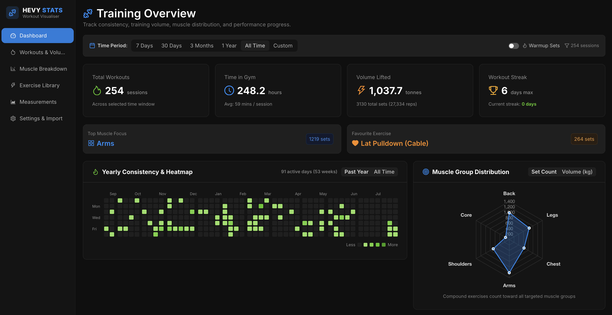

# Hevy Visualiser

A client-side analytics and progression dashboard for [Hevy](https://www.hevyapp.com/) workout and body measurement exports. Built with React 19, TypeScript, Vite, and Ant Design.

[](https://react.dev/)
[](https://www.typescriptlang.org/)
[](https://vitejs.dev/)
[](https://vitest.dev/)
[](https://opensource.org/licenses/MIT)

---

## Preview



---

## Key Features

- **Training Overview & Consistency**:
  - GitHub-style annual contribution calendar visualizing workout frequency.
  - Calculation of current and historical workout streaks.
  - Aggregations for total workouts, hours spent training, and cumulative volume lifted.

- **Strength Progress & 1RM Trends**:
  - Estimated 1RM calculation using the Epley formula: `Weight * (1 + Reps / 30)`.
  - Ordinary Least Squares (OLS) linear regression trendline for tracking strength trajectories over time.
  - Configurable time window filters: 7 Days, 30 Days, 3 Months, 1 Year, All Time, or custom date ranges.

- **Bodyweight & Calisthenics Support**:
  - Automatic detection of unweighted movements (e.g., bodyweight pull-ups, parallel bar knee/leg raises).
  - Switches display metrics from tonnage to max reps per set and total reps.
  - Dedicated segmented control for weighted calisthenics to toggle between weight/1RM metrics and rep volume.

- **Biomechanical Muscle Group Distribution**:
  - Weighted muscle group attribution reflecting compound movement mechanics rather than flat attribution.
  - Primary target movers receive 100% credit, secondary synergists receive 50% credit, and tertiary/stabilizers receive 20-40% credit.
  - Pure isolation exercises allocate 100% volume solely to their target muscle group.
  - Interactive radar balance chart and horizontal proportion bars.

- **Personal Records (PR) Timeline**:
  - Chronological progression of weight personal records across exercises with date stamps and workout context.

- **Body Measurements Tracking**:
  - Tracks bodyweight trends and circumferences (chest, waist, biceps, thighs, calves) from Hevy measurement exports.

- **Privacy & Offline First**:
  - Entirely client-side architecture.
  - Zero analytics, trackers, or remote backend servers.
  - CSV parsing executes via PapaParse within the browser, and custom data persists in browser localStorage.
  - Bundled with a realistic demonstration dataset out of the box.

---

## Tech Stack

- **Core**: React 19, TypeScript 5.7, Vite 6
- **UI Framework & Design**: Ant Design 5 (dark theme tokens), Lucide React, Tabler Icons
- **Data Visualization**: Chart.js 4, react-chartjs-2
- **Data Parsing & Utilities**: PapaParse, Day.js
- **Testing**: Vitest 3, React Testing Library, jsdom

---

## Getting Started

### Prerequisites

- Node.js (version 18.0.0 or higher recommended)
- npm (bundled with Node.js)

### Installation

Clone the repository and install dependencies:

```bash
git clone https://github.com/pangwuu/HevyVisualiser.git
cd HevyVisualiser
npm install
```

### Development

Run the local development server with Hot Module Replacement (HMR):

```bash
npm run dev
```

Open `http://localhost:5173` in your browser to view the application.

### Running Tests

Execute the automated test suite with Vitest:

```bash
npm run test
```

### Production Build

Compile and bundle the project for production deployment:

```bash
npm run build
```

Preview the production build locally:

```bash
npm run preview
```

---

## How to Export Data from Hevy

To visualize your personal data:

1. Open the **Hevy** app on iOS or Android.
2. Navigate to your **Profile** tab in the bottom right corner.
3. Tap the **Settings** gear icon in the top right corner.
4. Scroll to the **Data** section and select **Export & Import Data**.
5. Tap **Export Data**.
6. Save the generated `workout_data.csv` (or `measurement_data.csv`) to your device files.
7. Open **Hevy Visualiser**, navigate to **Settings & Import**, and drop or select your CSV file.

---

## Disclaimer

This project is an independent, open-source hobby tool and is not affiliated, associated, authorized, endorsed by, or in any way officially connected with Hevy, Hevy App Inc., or any of its subsidiaries or affiliates.

---

## License

This project is licensed under the MIT License.
